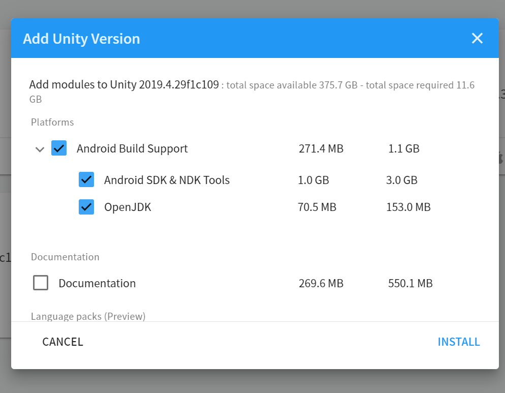
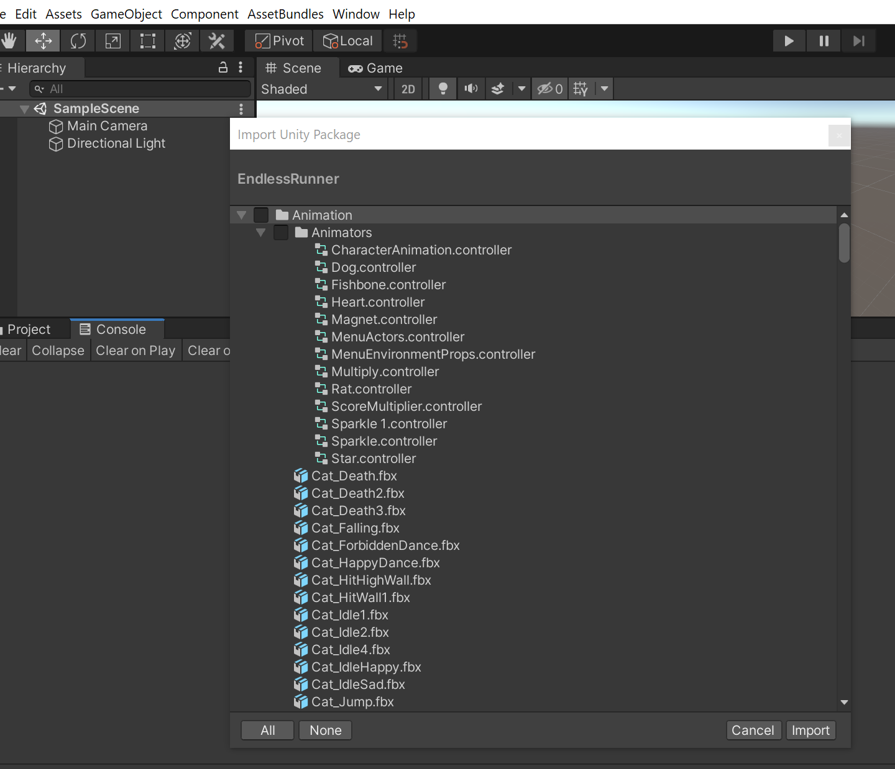
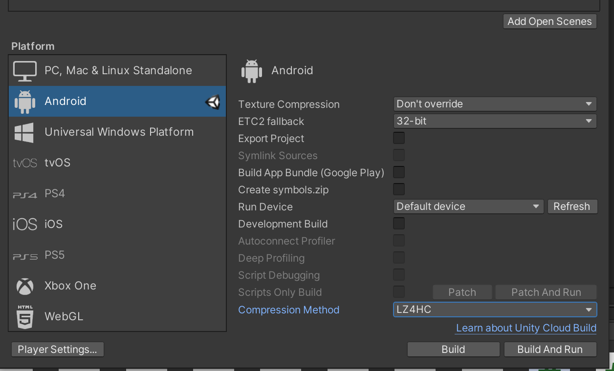
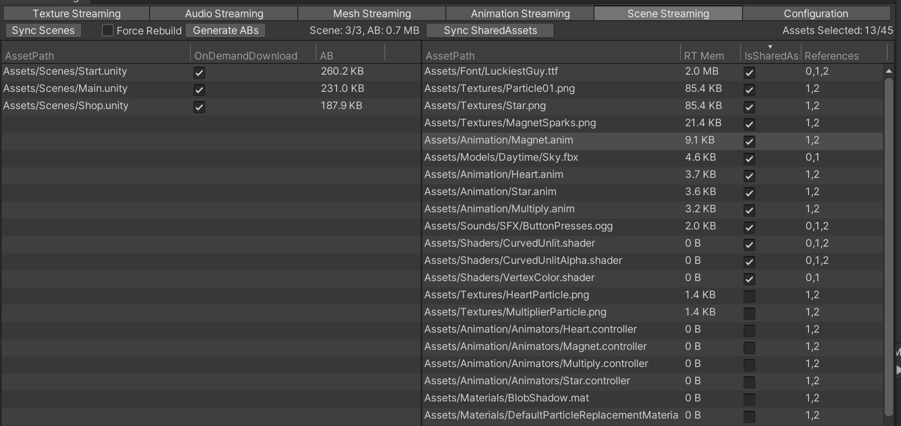
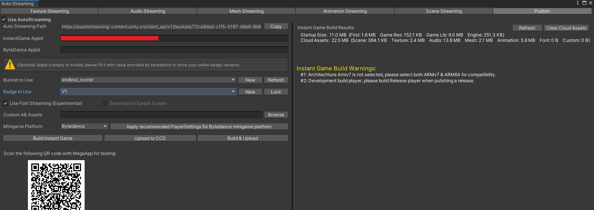
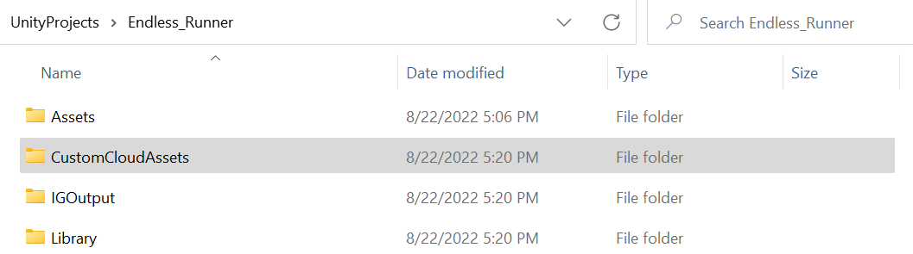
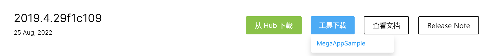

# 简介
Unity Instant Game是Unity最新的小游戏解决方案，可以轻松将高品质Unity手游转换成即点即玩，无需下载的小游戏，玩家可以获得完整的原生游戏体验。目前已支持的小游戏平台包括抖音小游戏、头条小游戏、手机QQ小游戏，更多小游戏平台正在陆续加入中。

# 支持平台

## [字节小游戏上线指南](https://bytedance.feishu.cn/docs/doccn1iD3ojIypRFORZOcRoEf1g)
## [快手小游戏 Unity Instant Game 接入说明](https://docs.qingque.cn/d/home/eZQCxPZeFJeasEKOxlcGm0W8D#section=h.w6ztipwh5ixw)
## [手Q小游戏 Unity Instant Game 接入说明](https://q.qq.com/wiki/)

# 安装定制版Unity Editor
Unity Instant Game定制版引擎现已登陆Unity官方网站, 前往[https://unity.cn/instantgame](https://unity.cn/instantgame "Unity Instant Game")页面即可下载最新版本。
如您未安装Unity Hub请按照网页提示或者前往[Unity Hub](https://unity.cn/releases )页面安装，然后从Intant Game页面点击从Hub下载，在弹出的Hub页面中，
确认勾选Android Build Support、Android SDK & NDK Tools以及OpenJDK，然后点击Install按钮即可。

# 云服务申请
Unity Instant Game 云端由 Unity CCD（Cloud Content Delivery）提供服务，使用前请按照以下流程申请CCD账号，并创建CCD项目 :

## 申请CCD账号：
1. CCD服务使用Unity账号，以组织作为基本单位进行管理，首先请前往 [Unity Cloud Content Delivery](https://developer.cloud.unity.cn/) 网页，登录个人Unity账号；

2. 在页面左侧选中 Account Binding 选项卡，选择需要使用CCD功能的组织，点击BIND，跳转至腾讯云授权页面，在该页面选择用于付费的腾讯云账号，进行授权绑定；
    1) 如果没有腾讯云账号，请先前往[腾讯云官网] https://cloud.tencent.com/ 进行注册。
    2) 腾讯云账号需要先进行实名认证，才能使用后续服务。

3. 绑定成功后，页面左侧选中 Cloud Content Delivery 选项卡，选择需要使用CCD功能的组织，点击开通服务。

## 创建CCD项目 :
1. 在 https://developer.cloud.unity.cn/ 首页，右上角选择已经开通CCD服务的组织，创建新的项目来使用CCD服务；
2. 点击项目名进入项目，在左侧 Content Delivery 选项卡下，可以使用Content Delivery相关的功能，以及查看信息。
   1) 初次使用，可以跟随 Getting Started，了解CCD的基本使用方法。

注：扣费操作会在腾讯云账号上执行，每天扣除前一天的使用费用，具体账单在腾讯云费用账单查询，产品名称为Unity游戏服务。**使用期间需要保持账户余额不为负**。

# 转换小游戏基本步骤
在接下来的文档中，将以[Endless Runner](Ig_doc_file/EndlessRunner.unitypackage)游戏为示例，介绍如何使用Instant Game功能转换小游戏，游戏工程可从以下链接获取[EndlessRunner.unitypackage](Ig_doc_file/EndlessRunner.unitypackage)。

## 1. 新建Endless Runner工程
使用定制版引擎 Unity2019.4.29f1c109新建工程Endless Runner，下载[EndlessRunner.unitypackage](Ig_doc_file/EndlessRunner.unitypackage)并导入工程。

## 2. 添加InstantGame需要Package

* 打开Package Manager，选择Unity Registry并勾选Show preview packages, 然后搜索“instant game”, 点击“install”安装以下package最新版本:

## 3. 切换平台和选择压缩格式
打开 File → Build Settings 窗口，切换到Android 平台，并选择 LZ4HC 压缩格式。同时确认**取消勾选export project**。

## 4. 打开Instant Game功能并选择小游戏平台
 InstantGame窗口位于Windows → Auto Streaming，该窗口包含了InstantGame的所有功能选项，打包小游戏前的资源streaming设置，以及上传云资源到CCD的设置。

* **切换到Cfg & Publish窗口，勾选Use AutoStreaming**，打开Instant Game功能；如果后续需要使用正常的打包流程，取消勾选该选项即可。

* **在Minigame Platform下拉列表中选择小游戏平台**, 切换小游戏平台过程中将自动为工程设置推荐的PlayerSettings设置(Scripting Backend, Target Architectures, Strip Engine Code)。
如果后续手动修改了PlayerSettings设置，可以通过点击 "Apply recommended PlayerSettings" 重新设置回来。

* **(推荐)切换图形API到GLES 3**, 在Project Settings → Player → Other Settings中取消Auto Graphics API,仅保留GLES 3，从而减少首包和下载的云资源。
该步骤可能花费较长的时间，请耐心等待。

* **(可选)勾选Use Font Streaming**，开启字体资源的Streaming；实验性功能。

## 5. 配置CCD云服务器
Unity Instant Game小游戏默认使用Unity CCD（Cloud Content Delivery）作为部署streaming资源的云服务器。Unity CCD 提供了便捷的云端资源的版本管理。

| 字段  | 描述 |
| ------------- | ------------- |
| InstantGame AppId  | CCD InstantGame项目标识字符串；该字符串作为上传CCD文件的钥匙，请注意保密;  |
| Bucket  | 文件桶，建议游戏的资源存放在一个bucket中，从而利用CCD资源版本管理和增量上传的优势提高开发效率； |
| Badge   | 每次上传文件到CCD，都会创建一个云服务器文件的release，Badge作为release的别名，用于固定资源下载的url；**每次发布小游戏新版本时，必须创建一个新的Badge使用**。  |

* 前往[Unity Content Delivery开发者首页](https://developer.cloud.unity.cn/ )，点击Create New Project，选择已经开通CCD服务的组织，创建一个名为 Endless_Runner 的项目；如已有CCD Project可跳过该步骤。

* 创建完成后，网页将自动跳转到Endless_Runner项目的Overview页面，点击前往Content Delivery → Instant Game App ID页面，然后点击右上角Open按钮，填写信息后即可获得Instant Game App ID。

* 复制该字符串并填写到Cfg & Publish窗口的InstantGame AppId输入框中 ，完成后单击左栏Refresh按钮拉取Endless_Runner的Bucket/Badge 信息。

* 选择或者创建新的Bucket/Badge 并使用。Endless_Runner项目是一个新建的CCD项目，当前并不存在bucket和badge，因此我们新建一个名为Endless_Runner的bucket，并在该bucket下新建一个名为v1的badge。

CCD会为每一个Bucket自动生成一个名为latest的badge，每次上传文件，该badge位置都会自动更新，始终指向最新的资源版本，因此**不要在提交给小游戏平台的版本中使用latest**，以免后续资源更新时影响已发布版本。

## 6. AB中的资源列表（可选）
我们希望把AB中的重度资源（Texture、Mesh等）抽取出来，放到云上，按需下载加载。这样可以大大减小AB的体积。这对于减小首包、减小AB下载时间都很有帮助。为了实现这个目的，InstantGame工具需要搜索AB中的资源。Unity支持两种方式指定哪些资源会被打包到哪个AB中：
- 在UnityEditor的Inspector中设置资源的AssetBundle名称
- 通过BuildPipeline.BuildAssetBundles(string outputPath, AssetBundleBuild[] builds, ...)在代码中动态指定

对于第二种情况，目前我们无法自动搜索出这些AB、以及他们引用了哪些资源。因此需要用户提供AB中的资源列表。在Auto Streaming -> Cfg & Publish窗口， 点击Custom AB Assets右侧的Browse 按钮选择一个文本格式的资源列表文件（首行为资源总数，之后每行为一个资源路径）。这个文件中只需要提供root资源即可，root资源依赖的其它资源可以被工具自动搜索到。
 
 

Endless Runner游戏工程中没有使用AssetBundle building map打包AB，因此跳过该步骤。

## 7. 设置模型导入默认材质（可选）
 如果游戏的AssetBundle中有FBX等模型资源文件，建议执行该步骤。

 

 在Assets目录下选择或新建一个默认材质，如ModelImportDefaultMat，并设置到ProjectSettings/Graphics/ 的Model Import Default Material 属性，
 然后点击IgTool/Reimport Models with DefaultImportMaterial。 
 该步骤将替换所有模型文件的默认材质，避免下一步骤打包AB时，产生大量Standard shader重复。

注意: 该步骤仅需操作一次，后续添加模型资源自动生效。Reimport Models with DefaultImportMaterial操作，模型资源过多时可能需要很长时间

## 8. 配置Texture Streaming
配置游戏内texture是否使用streaming功能，以及streaming placeholder的类型。Instant Game用placeholder图片替换游戏首包内的原始贴图，游戏运行时，先加载低分辨率/低信息量的贴图，快速启动游戏。当游戏首次使用到该Texture资源时，将触发引擎后台线程从CCD云端下载原始贴图，完成后自动替换为原始贴图。

| 功能  | 描述 |
| ------------- | ------------- |
| Sync Texture | 搜索 BuildSettings 中的 Scenes 引用到的所有 Texture 资源；|
| Force Rebuild |  勾选后点击Generate AssetBundles，将强制重新生成 texture 的 AssetBundles； |
| Generate AssetBundles | 为所有勾选的 texture 生成 AB，每张贴图一个 AB；|
| Generate Placeholders | 为所有勾选的 texture 生成一张低分辨率的替用贴图；对于少数不支持低分辨率贴图的情况（如使用spine旧版插件的图集，在代码中读取size的贴图，RawImage上使用的贴图），在勾选Placeholder 之外需要勾选BlurPlaceholder, 从而生成一张同样大小但信息量更少的图片； |
| ConvertLegacySpritePacker | 将旧式的Sprite packer 图集转换成SpriteAtlas，从而获得streaming支持；**该功能会清理所有sprite上的packing Tag，使用前请对工程做好备份**。|

**首次打包操作流程**：点击 convertLegacySpritePacker(可选) → Sync Texture → Ctrl + A 选择所有图片，勾选 Placeholder → 点击 Generate AssetBundles → 点击表头按生成的AB大小排序，取消勾选 AB 过小的图片（例如小 5KB，可按住Shift多选）→ 点击 Generate AssetBundles 清理不需要的AB → 点击 Generate Placeholders。

**更新操作流程**： Sync Texture → 调整Placeholder的勾选 → 勾选Force Rebuild → 点击 Generate AssetBundles重新生成AB →  点击 Generate Placeholders。

 注: 如果游戏中使用了图集SpriteAtlas，并且图集打包到了Addressables中，请在上述操作完成后，额外点击按钮 "Use SpriteAtlas Placeholder in Addressable"来替换其中的图集为小图。

## 9. 配置Audio/Mesh/Animation Streaming
配置游戏内的Audio/Mesh/Animation资源是否使用streaming功能。Instant Game支持将本地较大的音频和 mesh等资源内的数据从游戏首包/AB 中抽离出来，部署CCD服务器上。当游戏首次使用到该Audio/Mesh/Animation资源时，将触发引擎后台线程下载资源数据，完成后自动加载使用。

**使用流程**：点击 Sync Audios/Meshes/Animation → 勾选 RT Mem 较大（例如大于5K）的资源。

如果某个Audio/Mesh/Animation勾选了Streaming导致游戏出现问题（勾选Streaming会使Audio/Mesh的数据延迟，在代码中对该Audio/Mesh进行了读写操作， 可能出现问题），取消勾选该 Audio/Mesh/Animation 即可。

## 10. 场景Streaming
选择BuildSettings 中的场景，打包成 AssetBundle，并部署到CCD服务器上。开发者像往常一样通过 SceneManager 调用 LoadScene/LoadSceneAsync。底层将自动触发下载，完成后自动加载场景。

| 功能  | 描述 |
| ------------- | ------------- |
| Sync Scenes | 获取 build setting 中的 Scene，并在下方显示； |
| Force Rebuild | 勾选后，将强制重新生成 Scene 的 AssetBundles； |
| Generate AssetBundle | 生成场景的 AB，以及场景共享资源AB; |
| Sync SharedAssets | 搜索勾选了streaming的场景中的共同引用到的资源。 |

为实现场景的按需加载，我们把每个场景单独打包成一个AB。因此被多个场景引用的资源，会被重复打包进多个scene AB中，可能导致scene AB总量过大，浪费场景下载时间和CCD流量。
为了解决这个问题，我们把这些共享资源打包进一个额外的共享AB中，让scene AB依赖于这个共享AB，避免冗余。
由于共享AB(下图选中文件)需要在首场景前准备好，因而不宜过大(小于5MB)，我们建议仅勾选对场景AB总量影响严重的资源，如：
* 被大多数场景引用到的资源(References中包含场景序号较多的资源)
* 本身较大的shader等资源

一个FBX文件中可能包含模型材质等诸多资源，而场景引用的仅是其中的一个或少数几个，因此**不推荐勾选FBX文件**，避免共享AB过大。

**使用流程**： Sync Scenes → 选择需要streaming的场景 → Sync SharedAssets → 勾选SharedAssets资源 → 如果已经生成过场景AB，勾选Force Rebuild → Generate AssetBundles。

**Scene Streaming 依赖于 Texture/Audio/Mesh/Animation/Font Streaming的配置，请务必先执行前面的操作。**

## 11. 游戏AB/Addressables重打包（可选）
* 游戏工程使用了Asset bundle ，需要在配置好Texture/Audio/Mesh/Animation Streaming后，重新build Asset bundle（删除已有AB, 再打包）。

* 游戏工程使用了 Addressables，同样需要在配置好Texture/Audio/Mesh/Animation Streaming后重新打包。

在Endless Runner游戏工程中，使用了Asset bundle进行资源打包，因此需要完全重新打包，步骤如下：

* 如果已经打包过AB，删除StreamingAssets目录下的AB包
 

* 点击 AssetBundles -> Build AssetBundles 重新打包AB

**游戏AB/Addressables打包依赖于 Texture/Audio/Mesh/Animation/Font Streaming的配置，请务必先执行前面的操作。**

## 12. 拷贝AB到CCD上传目录（可选）
如果游戏的AB文件在开启了AutoStreaming后依旧比较大，可以选择将AB文件拷贝到CustomCloudAssets目录下的CloudAB文件夹，随后一起上传到CCD上。
CustomCloudAssets/CloudAB文件夹下的AssetBundle支持直接使用AssetBundle.LoadFromFileAsync(abNameOrPath)进行加载，
因此原本使用本地路径异步加载AB的代码逻辑无需改动。

CustomCloudAssets目录同时也支持Addressables，可以将Addressables打包出来的文件直接放到CustomCloudAssets或其子目录下，并将Addressables的RemoteLoadPath设置为：

**{Cfg & Publish页面可复制的Auto Streaming Path} + "/CUS/" + {自定义子目录}**。

## 13. 设置游戏最大缓存size
字节小游戏平台会设置游戏最大缓存限制，默认为200MB，超出后，会自动删除已有文件。如果在游戏运行时误删了正在使用的AB文件，则有可能导致程序崩溃。
为避免误删情况的出现，可以在打包时设置一个比小游戏平台小一些的缓存限制，超出限制时，由Unity引擎负责安全地清理不需要的文件。

* 打开Auto Streaming -> Cfg & Publish页面，在Max Cache Size中填写0 - 200MB之前的值；

* 建议设置为稍大于以下方式计算的值：
 
（Scene AB大小 + Texture 大小 + custom AB大小）/ Cloud Assets总量 \* 平台缓存限制

**注意：** 
* 云资源远小于200MB的游戏，可以不设置该值，避免重复下载
* 当该值为0时，Unity引擎不对AB缓存做任何限制； 
* 过小的值可能导致游戏启动时提示存储不足；
* 如果是重度游戏，且云资源非常多，通过设置MaxCacheSize依旧无法正常进行游戏，请联系小游戏平台方，将缓存限制设置为更大的值。

## 14. 打包小游戏并部署到CCD云服务器
* 打开Auto Streaming -> Cfg & Publish页面，在左侧选择使用的bucket和badge；
如果**当前选中的Badge已经用于版本发布，必须新建一个badge使用，否则将覆盖已有的版本**，另外**不建议使用latest badge**。

* 根据右侧的Instant Game Build Warnings提示，修改游戏工程设置。

* 确认选中的Minigame Platform 为目标小游戏平台。

* 上述操作完成后，点击Build Instant Game按钮即可进行小游戏打包。

* 打包完成后，点击右栏右上角的Refresh按钮，可查看的Instant Game打包结果统计信息。如果首包过大，请根据Instant Game Build Warnings的提示进行优化。

* (可选)如果有自定义的文件(如游戏边玩边下的AB)需要上传到CCD，请手动拷贝文件到工程目录下的CustomCloudAssets文件夹内(CustomCloudAssets文件夹具体使用请参考补充说明部分)。

* 自定义的CCD文件准备好后，点击Upload Built Instant Game 开始上传并部署小游戏到CCD云服务器；上传期间如果出现网络问题上传失败，重新点击上传按钮即可，上传工作会从上一次失败的位置继续执行。

* **打包和上传中间，请不要改动CCD配置，否则游戏运行时将找不到需要的资源。**

* 完成部署后，使用MegaApp扫描下方的二维码即可运行小游戏，该二维码仅供MegaApp测试使用。

* 如果遇到打包失败的问题，请先参照**补充说明**部分, 确认JDK/SDK/NDK配置正确。如果游戏从MegaApp中启动后，获取AutoStreaming云资源文件失败，可以尝试Clear Cloud Assets按钮清理所有云资源文件，然后重新打包。

## 15. 小游戏运行与测试
* MegaApp app中仅支持游戏自身的功能测试，**广告支付等功能需要在平台方发布测试版**后使用。已接入字节小游戏SDK的游戏，请更新字节SDK到最新版本，旧版SDK需打包**Development版本**才可以在MegaApp app运行。

* 从[Unity Instant Game](https://unity.cn/instantgame)网页下载c109版本下的MegaApp app并安装。该App中包含了一个BoatAttack转成的Instant Game示例，同时也是Unity Instant Game的测试工具。

* 启动MegaApp，打开二维码扫描功能，扫描Cfg & Publish窗口页面的二维码，即可运行小游戏。

 

## 16. 提交小游戏平台并测试

* **小游戏平台上的提审版本和发布版本都由测试版本转化而来，请不要在提交小游戏平台时使用CCD 的 latest Badge。**
### 字节小游戏

* 参照[StarkSDK_Unity文档-ig版](https://bytedance.feishu.cn/docs/doccnUBXqLK4YoSj6cj1tDx5Qeb) 下载字节小游戏工具，安装如下三个字节小游戏工具, **请安装带有Unity Ig Tools的版本。**

* 游戏上传到CCD后，打开字节发布页面，填写发布信息，选择游戏工程根目录下的IGOutput/ig_bytedance.json后点击发布按钮，生成二维码后，使用抖音或头条App扫码即可自测试。

* 游戏存档请存放在[字节小游戏目录说明与缓存策略](https://bytedance.feishu.cn/docx/doxcndqvjqK0FlitAnvamW2A0Pg)建议的位置，否则会存在存档丢失的风险。

### 快手小游戏
* 游戏上传完成后，通过[快手小游戏发布流程](https://docs.qingque.cn/d/home/eZQCxPZeFJeasEKOxlcGm0W8D), 将游戏工程根目录下的IGOutput/ig_kwai.json提交测试，完成后使用最新版快手 App 扫描生成的二维码即可自测试。

### 手Q小游戏
* 游戏上传完成后,前往[手Q小游戏发布](https://q.qq.com/#/release)页面，将游戏工程根目录下的IGOutput/ig_shouq.json提交测试，完成后使用最新版手Q App 扫描生成的二维码即可自测试。

## 17. 小游戏提审及发布和版本锁定
* 自测完成后，在小游戏平台将当前测试版本提交审核，测试版本转为提审版本； 小游戏平台方审核通过后即可发布，提审版本转为发布版本。
* **小游戏提审后，当前使用的CCD badge需要锁定，避免后续打包覆盖提审或者上线版本**。
    通过点击 Badge to Use最右边的lock按钮可以手动将当前选定的badge锁住，避免被覆盖。

* 字节小游戏平台可以通过填写字节小游戏的Appid自动锁住提审和发布版本。

* **小游戏平台启动小游戏前会校验游戏首包文件MD5，覆盖提审或者上线版本将导致，游戏无法启动！！！**

## 补充说明
### 功能：
* Instant Game不支持对使用Packing Tag的Sprite做Streaming，仅支持SpriteAtlas的Streaming；
但可以通过InstantGame提供的功能将使用Packing Tag的Sprite转为支持Streaming的SpriteAtlas。
当项目的Play Settings/Editor/Sprite Packer/Mode 为Enable For Build (Legacy Sprite Packer)或Always Enable(Legacy Sprite Packer)时，
Instant Game界面才会显示ConvertLegacySpritePacker按钮。

* Texture2D 对应的Placeholder文件默认Max Size 为32，特殊情况下，可通过Texture 的Insepector中适当调高Max Size的值（一般不高于256），从而改善首次进入游戏的体验。Placeholder 存放在Assets/AutoStreamingData/Placeholders 目录下。

* 如果il2cpp游戏首包超过20M，可以尝试开启stripEngineCode，可减少首包约3M左右，但strip后的引擎文件不再共享。

* 非字节平台可选择使用Mono打包，Instant Game支持64位Mono，并且大多数情况下首包相比il2cpp更小。

* CustomCloudAssets目录下的文件(C106版本后支持子目录)将在点击Auto Streaming → Cfg & Publish → Upload to CCD时随其他资源文件一起上传到CCD，文件的下载地址为：
 
使用AutoStreaming.CustomCloudAssetsRoot字段，需要启用步骤2中built-in package Auto Streaming。
如因其他原因无法使用AutoStreaming.CustomCloudAssetsRoot字段，可以选择手动拼接URL，拼接规则为
**{Cfg & Publish页面可复制的Auto Streaming Path} + "/CUS/" + {自定义文件名}**。

* 如代码中有自定义打包脚本，可通过调用InstantGame提供的BuildPlayer接口打包InstantGame。
 

* AutoStreaming资源文件可通过同目录下，与其同名的*.abas.info或*.abas.manifest文件查看对应的原始资源。
 
 

 * AssetBundle依赖分析工具可用于查看游戏AB内的对象，资源和依赖关系，用于帮助优化AB打包时的资源组织结构，从而减少游戏启动时，需要使用到的AB总量。
  

### 建议：
* 推荐所有Texture都使用ETC或者ETC2压缩格式，从而大幅降低游戏内存占用并小幅减小场景AB和首包的size。

* 推荐使用Strip后的字体文件，即仅包含会使用到的字符的字体文件（如中文常用3000/6500字+英文字符+中英文标点），从而减小场景AB和首包的size。

* 打包游戏前建议将Managed Stripping Level开到游戏支持的最高级别，从而减小首包大小。

* 小游戏存档建议保存在服务器，避免丢失。本地存档请优先保存在小游戏平台推荐的位置，也可以通过Unity PlayerPrefs保存。直接使用本地文件保存的存档存在被清理的风险。

### 问题：
* 如果操作失误，上传文件到CCD时覆盖了已有版本的badge，请前往CCD网站将Badge标签设置回来。

* 如果定制版Unity不是从Unity Hub安装的，请使用Hub下载官方版本的unity 2019.4.29f1c2并勾选SDK、NDK，完成后请打开定制版Unity 的 Edit → Preference → External Tools窗口，将JDK，SDK，NDK按如下路径设置，然后重启Editor。

* 使用了**旧版spine插件**的工程，所有spine图集必须勾选BlurPlaceholder，否则会出现显示错误; 因此推荐**将spine插件升级到3.7.xx(2019-05-06)之后的版本**。

* 如果打包过程出现异常，可尝试打开PackageManger，删除报错的package， 重新安装步骤2中的package以确保package版本最新。

* 如果遇到游戏启动后一直黑屏/花屏，并且游戏开启了strip engine code选项，请确认步骤2中built-in package Auto Streaming已启用。

* 如果遇到游戏启动时crash，并输出类似 "Class com.unity.instantgame.UnityPlayerActivity not found" 以及 "No original dex files found for dex location .../first.zip" 的错误提示，请检查first.zip内是否有中文名的资源。

* 如果游戏已使用c102及以前的版本转换，迁移到新版本请删除Assets/Plugins/InstantGame 和Assets/InstantGameData目录后重新构建资源。

* 不同版本的InstantGame定制 Editor生成的streaming文件存在不兼容的情况，使用新版本打包前，请点击Clear Cloud Assets清理所有streaming云资源文件，然后完全重新打包。
Texture的placeholder 以及Auto Streaming的配置可复用。

# 预下载功能使用流程：
使用AutoStreaming功能按需加载资源，首次进入游戏时，因资源从云端下载到本地需要时间，能看到纹理从模糊变清晰和模型逐渐弹出的过程。当用户网络较差，或者大量游戏资源集中加载时，可能导致用户体验不佳。使用预下载功能可以提前将即将使用的资源提前下载，从而提升用户体验。

预下载功能以tag标签为单位，将多个云资源合并成一个预下载文件，对于改善零碎文件下载也有一定帮助。预下载功能默认以buildSettings中的场景来划分tag标签，也支持在代码中额外添加标签：

1. 将所有用到的场景加入buildSettings中并勾选上；

2. 点击IgTool->GeneratePre-downloadList for Scenes, 将执行场景静态分析，并在Library/AutroStreamingCaches/ScenePredownload目录下生成预下载列表，
该列表以场景名为tag标签，可用于在场景加载前进行预下载；

3. 还原buildSettings中的场景设置；

4. 点击IgTool -> Pack Pre-download Bundles，在弹出的文件选择框中选择Library/AutoStreamingCache/ScenePredownload 目录，来使用步骤2生成的预下载列表，生成.pred文件到CustomCloudAssets

5. 在代码中加载场景前加上AutoStreaming.PredownloadAssetsAsync(sceneName，priority, showProgress)  用于在加载场景前预加载资源。 AutoStreaming.PredownloadAssetsAsync(sceneName,，priority, showProgress) 返回一个异步操作并提供加载进度，可选择是否等待异步操作完成后再加载场景，showProgress参数可以控制是否在屏幕最底部显示默认的下载进度条。
由于场景静态分析只能分析出场景文件中引用到的资源，如果运行时从AB和Resources文件夹加载的资源较多，可在加载场景前加上AutoStreaming.MarkRecordBegin(sceneName)，来补充预下载资源的运行时录制。

    示例：
    
    *yield return AutoStreaming.PredownloadAssetsAsync(levelName, 0);*

    *AutoStreaming.MarkRecordBegin(levelName)*；

    *SceneManager.LoadScene(levelName, LoadSceneMode.Single);*

    AutoStreaming.MarkRecordBegin(tagName) 也可自定义tagName名称，用于其他适合等待资源加载的位置。注意AutoStreaming.MarkRecordBegin(tagName) 和AutoStreaming.PredownloadAssetsAsync(tagName，priority, showProgress) 需要成对出现。注意，首次录制时，当前游戏还没有tagName标识的预加载分包，AutoStreaming.PredownloadAssetsAsync(tagName)将返回null；

6. 按照打包流程中的步骤**打包小游戏并部署到CCD云服务器**，打包小游戏

7. 打开MegaApp，扫码运行。运行关键场景并点开主要界面，引擎会自动录制游戏资源下载列表。

8. 一段时间后，拷贝手机data/data/com.unity.ig017a/com.xxx.xxx/Predownload 目录下的log文件到工程Library/AutoStreamingCache/ScenePredownload 目录, 用于迭代优化预下载包

9. 点击IgTool/Pack Pre-downloadBundles，选择Library/AutoStreamingCache/ScenePredownload 目录，将自动合并运行时录制的预下载列表，并重新生成预下载分包

10. 重复步骤6，打包小游戏

11. 步骤7 - 10可重复多次，来优化预下载分包。预下载录制功能，支持单设备多次运行录制，也可以多设备同时运行游戏

# 游戏版本更新打包流程：
## 仅代码改动：
* 在Cfg & Publish页面创建一个新的badge并使用；
* 重新执行 步骤 **打包小游戏并部署到CCD云服务器** 之后的操作即可。

## prefab与Scene文件改动：
* 在Scene Streaming页面，点击 Sync Scenes → 勾选force rebuild → Generate AssetBundles；
* 如果项目原本有打包AB或者使用Addressables, 则需要重新build AB；
* 其余操作与**仅代码改动**时一致。

## texture/audio/mesh资源改动:
* Texture 资源变动： 重新sync，调整需要Streamingd资源 → 勾选force rebuild → 点击Generate AssetBundles重新打包AB → 点击Generate placeholder；
* audio/mesh资源变动: 重新sync，调整需要Streamingd资源；
* 其余操作与**prefab与Scene文件改动**时一致。

# FAQ:
1. 游戏刚启动，弹框提示："No scene found! Please add at least one scene to build settings."。
* 当Build settings里面的Scene列表为空时，打包InstantGame不会自动打包当前打开的场景，请确认项目的build settings-> Scene列表是否为空。

2. 游戏启动后，提示下载失败或者网络不给力。
* 游戏用到了某个Streaming的资源，但CCD服务器上没有，则会提示网络不给力。可能发生的原因：重新打包了游戏apk或InstantGame，忘了点上传; 打包和上传中间，改动了CCD配置，导致上传的位置和下载的位置不一致。

3. 游戏上传到CCD后，用MegaApp扫描二维码，提示 "This game does not support abi "armeabi-v7a/arm64-v8a""
* 请确认unity项目的PlayerSettings ->Player-> other Settings中的Target Architectures 同时勾选了ARMv7和ARM64。

4. 打包好的游戏，上传到抖音后，部分或全部手机启动闪退，无法进入游戏。
* 部分手机闪退请确认游戏是否同时打包32位和64位，所有手机都无法进入，请检查上传抖音的json文件和CCD当前的文件版本是否一致（MD5相同），当前使用的CCD Badge是否被覆盖。

5. URP游戏上传json文件到字节小游戏提示“发布失败： 设置错误：场景中的Canvas Render Mode 不能为Overlay”，录屏缺少后效和UI。
* 请将字节小游戏Stark SDK升级到5.6.0之后的版本，Unity Ig Tools升级到最新版本，升级后可能依旧会显示该提示
(上传json文件时可临时取消勾选BuildSettings中的所有场景绕过，后续更新将修复)，但录屏异常问题已修复。

6. 如果我什么都没有改变，只是重新打了包，还需要上传吗?
* 重新打包的时候，会重新生成首包文件，每次生成的首包MD5都不一样，小游戏平台在启动游戏前会校验首包文件的MD5，所以需要重新上传。

7. 游戏内有从AB和Resources文件夹加载资源的逻辑，做了streaming后该如何加载?
* 对于Texture2D和SpriteAtlas资源，AutoStreaming使用了一个小分辨率的资源替换了原资源；
对于AudioClip、Mesh和AnimationClip资源，AutoStreaming仅抽取了其中的重度数据，Asset对象依旧存在，
因此可以按照原来的逻辑加载AB和Resources内的Asset。
但做了streaming之后，Asset内的数据不可立即访问，
例如Mesh.vertices，Texture2D.GetPixels(),Texture2D.GetWidth()，AudioClip.LoadAudioData()
等接口的调用可能会返回null或者不正确的结果。

8. 在[InstantGame](https://unity.cn/instantgame)网页点击"从Hub下载"，跳转到了Unity Hub，但没有弹出下载页面。
* 仅中国版Unity Hub支持从Hub下载InstantGame定制版。

9.上传文件到CCD时，报CoseServerException:(statusCode = 403, statusMessage = Forbidden, errorCode = AccessDenied, errorMessage = "....")错误。
* 请先关闭Unity Editor后重试，如果该方法无效，请根据errorMessage的值参考[腾讯云故障处理](https://cloud.tencent.com/document/product/436/54303)文档查找具体原因。

10.部分Android 10以上的手机运行小游戏时卡住或闪退，错误日志中有“use memory address more than 16GB”的提示。
* 2019.4.29f1c106之后的版本已修复该问题，推荐使用最新发布的InstantGame Editor。

# 版本历史：

## 2019.4.29f1c109  --  2022/08/22
* 新增预下载功能
* 新增AB依赖分析工具
* 新增缓存限制和自动清理功能
* 支持设置模型导入默认材质，避免打包AB时standard shader大量重复
* 修复mono 64在Android 10以上的设备上，断言失败的问题
* 修复SpriteAtlas.GetSprites()，NGUI UITexture无材质时，纹理不变清晰的问题
* 简化CCD url，不再使用Encoding字符

## 2019.4.29f1c106  --  2021/12/14
* 升级Unity版本到2019.4.29f1
* 优化Sync资源的时间和打包instantgame的时间
* 新增animation streaming的UI界面
* 新增streaming资源搜索功能
* 新增scene streaming可选功能
* 新增scene streaming中的shared scene asset功能，用于减少scene AB的资源冗余
* 新增cubemap的streaming支持，重新点击Sync Textures可找出所有引用的cubemap
* 新增blendshape类型Mesh的streaming支持，重新点击Sync Meshes可找出所有引用的blendshape
* 新增AutoStreaming.CustomCloudAssetsRoot字段提供Custom资源的下载根路径
* 新增Instant Game打包结果统计信息和提示信息
* instantgame package合为一个，并在Package Manager中上线

## 2019.4.9f1c105  --  2021/07/29
* 新增Mac OS支持
* 新增ParticleMeshRender上的Mesh streaming支持
* 新增场景lightmaps的streaming支持
* 新增快手小游戏平台支持
* 新增手Q小游戏平台支持

## 2019.4.9f1c104  --  2021/06/27
* 优化游戏启动速度
* 新增Badge锁定功能，用于保护线上版本
* 新增readable Texture/Mesh Editor提示

## 2019.4.9f1c103  --  2021/06/16
* 重新构建InstantGame package成为Package Manager中com.unity.autostreaming, com.unity.autostreaming.ccd 和 com.unity.instantgame三个package;
* 新增了Legacy Animation Clip的streaming支持
* 优化生成placeholder的速度
* 优化CCD文件上传的速度和稳定性
* 新增Il2cpp strip engine code的支持，开启后libunity.so会减小，但不再作为引擎共享文件
* 新增Text Mesh Pro中font Texture的streaming支持

## 2019.4.9f1c102  --  2021/05/10
* 新增了Font资源的Streaming功能
* 新增了Animation资源的Streaming功能
* 新增了从MegaApp连接Unity profiler和debug的支持

## 2019.4.9f1c101  --  2021/04/09
* 首次发布
* 支持字节小游戏平台
* 支持Texture资源的Streaming功能
* 支持Audio资源的Streaming功能
* 支持Mesh资源的Streaming功能
* 支持Scene资源的Streaming功能