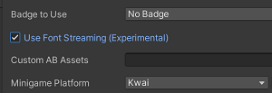
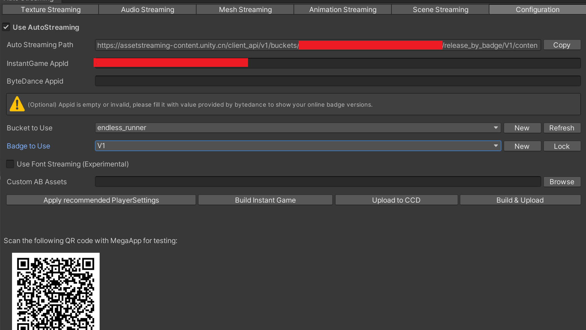

# 简介
Unity Instant Game是Unity最新的小游戏解决方案，可以轻松将高品质Unity手游转换成即点即玩，无需下载的小游戏，玩家可以获得完整的原生游戏体验。目前已支持的小游戏平台包括抖音小游戏、头条小游戏、手机QQ小游戏，更多小游戏平台正在陆续加入中。

# 安装定制版Unity Editor
Unity Instant Game定制版引擎现已登陆Unity官方网站, 前往[https://unity.cn/instantgame](https://unity.cn/instantgame "Unity Instant Game")页面即可下载最新版本。如您未安装Unity Hub请按照网页提示或者前往[Unity Hub](https://unity.cn/releases )页面安装，然后从Intant Game页面点击从Hub下载，在弹出的Hub页面中，确认勾选JDK、SDK、NDK，然后点击Install按钮即可。

# 云服务申请
Unity Instant Game 云端由 Unity CCD（Cloud Content Delivery）提供服务，使用前请按照以下流程申请CCD账号，并创建CCD项目 :

## 申请CCD账号：
1. CCD服务使用Unity账号，以组织作为基本单位进行管理，首先请前往 [Unity Cloud Content Delivery](https://developer.cloud.unity.cn/) 网页，登录个人Unity账号；

2. 在页面左侧选中 Account Binding 选项卡，选择需要使用CCD功能的组织，点击BIND，跳转至腾讯云授权页面，在该页面选择用于付费的腾讯云账号，进行授权绑定；
    1) 如果没有腾讯云账号，请先前往[腾讯云官网] https://cloud.tencent.com/ 进行注册。
    2) 腾讯云账号需要先进行实名认证，才能使用后续服务。

3. 绑定成功后，页面左侧选中 Cloud Content Delivery 选项卡，选择需要使用CCD功能的组织，点击开通服务。

## 创建CCD项目 :
1. 在 https://developer.cloud.unity.cn/ 首页，右上角选择已经开通CCD服务的组织，创建新的项目来使用CCD服务；
2. 点击项目名进入项目，在左侧 Content Delivery 选项卡下，可以使用Content Delivery相关的功能，以及查看信息。
   1) 初次使用，可以跟随 Getting Started，了解CCD的基本使用方法。

## 收费标准 :
CCD服务仅根据下载资源产生的流量收费，采用月度阶梯累进模式，阶梯价格如下：

| 使用量  | 价格（元/GB） |
| ------------- | ------------- |
| 0TB - 2TB  | 0.2625  |
| 2TB - 10TB  | 0.25  |
| 10TB - 50TB  | 0.225 |
| 50TB - 100TB  | 0.1875  |
| 100TB以上 | 0.1375  |

扣费操作会在腾讯云账号上执行，每天扣除前一天的使用费用，具体账单在腾讯云费用账单查询，产品名称为Unity游戏服务。**使用期间需要保持账户余额不为负**。

# 支持平台

## [字节小游戏上线指南](https://bytedance.feishu.cn/docs/doccn1iD3ojIypRFORZOcRoEf1g)

# 转换小游戏基本步骤
在接下来的文档中，将以[Endless Runner](Ig_doc_file/EndlessRunner.unitypackage)游戏为示例，介绍如何使用Instant Game功能转换小游戏，游戏工程可从以下链接获取[EndlessRunner.unitypackage](Ig_doc_file/EndlessRunner.unitypackage)。

 ## 1. 新建Endless Runner工程
使用定制版引擎 Unity2019.4.9f1c105新建工程Endless Runner，下载[EndlessRunner.unitypackage](Ig_doc_file/EndlessRunner.unitypackage)并导入工程。

 ## 2. 添加InstantGame需要Package

打开Package Manager，勾选 Show preview packages, 搜索“Instant Game”,点击“install”安装package，将安装以下三个package:

对于新建的工程，三个package已经自动加到工程中，可以跳过该步骤。

 ## 3. 切换平台和选择压缩格式
打开 File → Build Settings 窗口，切换到Android 平台，并选择 LZ4HC 压缩格式。同时确认**取消勾选export project**。

 ## 4. 打开Instant Game功能并应用推荐设置
 InstantGame窗口位于Windows → Auto Streaming，该窗口包含了InstantGame的所有功能选项，打包小游戏前的资源streaming设置，以及上传资源到CCD的设置。

* **切换到Configuration窗口，勾选Use AutoStreaming**，打开Instant Game功能；如果后续需要使用正常的打包流程，取消勾选该选项即可。

* **点击Apply recommended PlayerSettings按钮**，一键设置推荐的ProjectSettings；更多信息可以查看该按钮的鼠标悬浮提示。

开启Animation和Font资源的Streaming(可选):

* **勾选Use Animation Streaming**，实验性功能，如果项目中使用了Timeline，建议取消勾选。

* **勾选Use Font Streaming**，实验性功能。

 ## 5. 配置CCD云服务器
Unity Instant Game小游戏默认使用Unity CCD（Cloud Content Delivery）作为部署streaming资源的云服务器。Unity CCD 提供了便捷的云端资源的版本管理。

| 字段  | 描述 |
| ------------- | ------------- |
| InstantGame AppId  | CCD InstantGame项目标识字符串；  |
| Bucket  | 文件桶，建议游戏的资源存放在一个bucket中，从而利用CCD资源版本管理和增量上传的优势提高开发效率； |
| Badge   | 便于版本管理的 tag 标签，可选择绑定在任何一个 Release 上，而不改变文件访问地址 ，建议每次发布游戏新版本时，创建一个新的Badge；  |

* 前往[Unity Content Delivery开发者首页](https://developer.cloud.unity.cn/ )，点击Create New Project，选择已经开通CCD服务的组织，创建一个名为 Endless_Runner 的项目；如已有CCD Project可跳过该步骤

* 创建完成后，网页将自动跳转到Endless_Runner项目的Overview页面，点击Content Delivery → Instant Game App ID，点击右上角Open按钮，填写信息后即可获得Instant Game App ID；

* 复制该字符串并填写到Configuration窗口的InstantGame AppId输入框中 ，完成后单击Refresh按钮拉取Endless_Runner的Bucket/Badge 信息；

* 选择或者创建新的Bucket/Badge 并使用。Endless_Runner项目是一个新建的CCD项目，当前并不存在bucket和badge，因此我们新建一个名为Endless_Runner的bucket，并在该bucket下新建一个名为v1的badge；

CCD会为每一个Bucket自动生成一个名为latest的badge，该badge位置会自动更新，且始终指向最新的资源版本，因此**不要在发布公开版本时使用latest**，以免后续资源更新时影响已发布版本。

 ## 6. AB中的资源列表（可选）
如果游戏使用AssetBundle building map打包AB，目前我们无法自动搜索出这些AB引用了哪些资源，因此需要用户提供AB中的资源列表。在Auto Streaming -> Configuration窗口， 点击Custom AB Assets右侧的Browse 按钮选择一个文本格式的资源列表文件（首行为资源总数，之后每行为一个资源路径）。

Endless Runner游戏工程中没有使用AssetBundle building map打包AB，因此跳过该步骤。

 ## 7. 配置Texture Streaming
配置游戏内texture是否使用streaming功能，以及streaming placeholder的类型。Instant Game用placeholder图片替换游戏首包内的原始贴图，游戏运行时，先加载低分辨率/低信息量的贴图，快速启动游戏。当游戏首次使用到该Texture资源时，将触发引擎后台线程从CCD云端下载原始贴图，完成后自动替换为原始贴图。

| 功能  | 描述 |
| ------------- | ------------- |
| Sync Texture | 搜索 BuildSettings 中的 Scenes 引用到的所有 Texture 资源；|
| Force Rebuild |  勾选后点击Generate AssetBundles，将强制重新生成 texture 的 AssetBundles； |
| Generate AssetBundles | 为所有勾选的 texture 生成 AB，每张贴图一个 AB；|
| Generate Placeholders | 为所有勾选的 texture 生成一张低分辨率的替用贴图；对于少数不支持低分辨率贴图的情况（如使用spine插件的图集，在代码中读取size的贴图，RawImage上使用的贴图），在勾选Placeholder 之外需要勾选BlurPlaceholder, 从而生成一张同样大小但信息量更少的图片 |
| ConvertLegacySpritePacker | 将旧式的Sprite packer 图集，转换成SpriteAtlas  从而获得streaming支持；**该功能会清理所有sprite上的packing Tag，使用前请对工程做好备份**。|

**首次打包操作流程**：点击 convertLegacySpritePacker → Sync Texture → Ctrl + A 选择所有图片，勾选 Placeholder → 点击 Generate AssetBundles → 点击表头按生成的 AB 大小排序 取消勾选 AB 过小的图片（例如小 5KB，可使用Shift多选）→ 点击 Generate AssetBundles 清理不需要的AB → 点击 Generate Placeholders.

**更新操作流程**： Sync Texture → 调整Placeholder的勾选 → 勾选Force Rebuild → 点击 Generate AssetBundles 清理不需要的AB →  点击 Generate Placeholders.

 ## 8. 配置Audio/Mesh Streaming
配置游戏内的Audio/Mesh资源是否使用streaming功能。Instant Game支持将本地较大的音频和 mesh 资源内的数据从游戏首包/AB 中抽离出来，部署CCD服务器上。当游戏首次使用到该Audio/Mesh资源时，将触发引擎后台线程下载资源数据，完成后自动加载使用。

**使用流程**：点击 Sync Audios/Meshes → 勾选 RT Mem 较大（例如大于5K）的资源

如果某个Mesh勾选了Streaming导致游戏出现问题（勾选Streaming会使mesh的数据延迟，在代码中对该mesh进行了读写操作， 可能出现问题），取消勾选该 mesh 即可。

 ## 9. 场景Streaming
将BuildSettings 中的场景，打包成 AssetBundle，并部署到CCD服务器上。开发者像往常一样通过 SceneManager 调用 LoadScene/LoadSceneAsync。底层将自动触发下载，完成后自动加载场景。

| 功能  | 描述 |
| ------------- | ------------- |
| Sync Scenes | 获取 build setting 中的 Scene，并在下方显示； |
| Force Rebuild | 勾选后，将强制重新生成 Scene 的 AssetBundles； |
| Generate AssetBundle | 生成场景的 AB，以及 placeholderAB。 |

**使用流程**： Sync Scenes → 如果已经生成过场景AB，勾选Force Rebuild → Generate AssetBundles.

Scene Streaming 依赖于 Texture/Audio/Mesh Streaming，请务必先执行前面的操作。

 ## 10. 游戏AB/Addressable重打包（可选）
 * 游戏工程使用了Asset bundle ，需要在配置好Texture/Audio/Mesh Streaming后，重新build Asset bundle（删除已有AB, 再打包）；

* 游戏工程使用了 addressable，同样需要在配置好Texture/Audio/Mesh Streaming后重新打包。

在Endless Runner游戏工程中，使用了Asset bundle进行资源打包，因此需要完全重新打包，步骤如下：

 * 如果已经打包过AB，删除StreamingAssets目录下的AB包
 

 * 点击 AssetBundles -> Build AssetBundles 重新打包AB

 ## 11. 打包小游戏并部署到CCD云服务器
* 打开Auto Streaming -> Configuration窗口，选择使用的bucket和badge；

* 如果**当前选中的Badge已经用于版本发布，必须新建一个badge使用，否则将覆盖已有的版本**；

* CCD配置完成后，点击Build Instant Game按钮即可进行小游戏打包；

* 打包完成后，点击Upload Built Instant Game 开始上传并部署小游戏到CCD云服务器；上传期间如果出现网络问题上传失败，重新点击上传按钮即可，上传工作会从上一次失败的位置继续执行；

* 完成部署后，使用MegaApp扫描下方的二维码即可运行小游戏，该二维码仅供MegaApp测试使用；

* 如果遇到打包失败的问题，请先参照**补充说明**部分, 确认JDK/SDK/NDK配置正确。

打包和上传中间，请不要改动CCD配置，否则游戏运行时将找不到需要的资源。

 ## 12. 小游戏运行与测试
* MegaApp app中仅支持游戏自身的功能测试，**广告支付等功能需要在平台方发布测试版**后使用。已接入字节SDK的游戏，受平台SDK限制需打包**Development版本**才可以在MegaApp app运行。

* 从[Unity Instant Game](https://unity.cn/instantgame)网页下载MegaApp app并安装。该App中包含了一个BoatAttack 转成的Instant Game示例，同时也是Unity Instant Game的测试工具。

* 启动MegaApp，打开二维码扫描功能，扫描Configuration窗口页面的二维码，即可运行小游戏。

 

## 13. 提交小游戏平台并测试

### 字节小游戏

* 游戏上传完成后，打开字节发布页面，填写发布信息，选择游戏工程根目录下的IGOutput/ig_bytedance.json后点击发布按钮，生成二维码后，使用抖音或头条App扫码即可自测试。

### 快手小游戏
 * 游戏上传完成后，通过[快手小游戏发布流程](https://docs.qingque.cn/d/home/eZQCxPZeFJeasEKOxlcGm0W8D), 将游戏工程根目录下的IGOutput/ig_kwai.json提交审核，完成后使用最新版快手 App 扫描生成的二维码即可自测试。

### 手Q小游戏
 * TBA

## 补充说明
### 功能：
* Instant Game不支持对使用Packing Tag的Sprite 的Streaming，仅支持SpriteAtlas的Streaming；但可以通过InstantGame提供的功能将使用Packing Tag的Sprite转为支持Streaming的SpriteAtlas。当项目的Play Settings/Editor/Sprite Packer/Mode 为Enable For Build (Legacy Sprite Packer)或Always Enable(Legacy Sprite Packer)时，Instant Game界面才会显示ConvertLegacySpritePacker按钮

* Texture2D 对应的Placeholder文件默认Max Size 为32，特殊情况下，可通过Texture 的Insepector中适当调高Max Size的值（一般不高于256），从而改善首次进入游戏的体验。Placeholder 存放在Assets/AutoStreamingData/Placeholders 目录下

* 如果il2cpp游戏首包超过20M，可以尝试开启stripEngineCode，可减少首包约3M左右，但strip后的引擎文件不再共享

* 非字节平台可选择使用Mono打包，但必须使用 .Net 4.x Api

### 建议：
* 推荐所有Texture都使用ETC或者ETC2压缩格式，从而大幅降低游戏内存占用并小幅减小场景AB和首包的size

* 推荐使用Strip后的字体文件，即仅包含会使用到的字符的字体文件（如中文常用3000/6500字+英文字符+中英文标点），从而减小场景AB和首包的size。

* 首包大小, mono不宜超过10M, il2cpp 不宜超过 20M,  场景AB不宜超过5M, 否则会导致下载/加载时间过长，影响体验

* 打包游戏前建议将Managed Stripping Level开到游戏支持的最高级别，从而减小首包大小

### 问题：
* 如果操作失误，上传文件到CCD时覆盖了已有版本的badge，请前往CCD网站将Badge标签设置回来

* 如果定制版Unity不是从从Unity Hub安装的，请使用Hub下载官方版本的unity2019.4.9f1c1并勾选SDK、NDK，完成后请打开定制版Unity 的 Edit → Preference → External Tools窗口，将JDK，SDK，NDK按如下路径设置，然后重启Editor

* 如果打包过程出现异常，请打开PackageManger，重新安装步骤2中的三个package以确保package版本正确；

* 如果遇到游戏启动时crash，并输出类似 "Cannot create web request without initializing the system"的错误提示，请取消勾选stripEngineCode

* 如果游戏已使用c102及以前的版本转换，迁移到新版本请删除Assets/Plugins/InstantGame 和Assets/InstantGameData目录后重新构建资源；

# 游戏版本更新打包流程：
## 仅代码改动：
* 在Configuration增加一个新的badge并使用
* 重新执行 步骤 **11. 打包小游戏并部署到CCD云服务器** 之后的操作即可

## prefab与Scene文件改动：
* 在Scene Streaming页面，点击 Sync Scenes → 勾选force rebuild → Generate AssetBundles.
* 如果项目原本有打包AB或者使用Addressables, 重新build AB
* 其余操作与**仅代码改动**时一致

## texture/audio/mesh资源改动:
* Texture 资源变动： 重新 sync， 如果变动的texture原本勾选了streaming，或者有新的texture加入streaming， 勾选force rebuild,  重新打包AB,  并重新生成placeholder
* audio/mesh资源变动: 重新 sync即可
* 其余操作与**prefab与Scene文件改动**时一致

#  版本历史：

## 2019.4.9f1c105  --  2021/07/29
  * 新增ParticleMeshRender上的Mesh streaming支持
  * 新增场景lightmaps的streaming支持
  * 支持快手小游戏平台
  * 支持手Q小游戏平台

## 2019.4.9f1c104  --  2021/06/27
  * 优化游戏启动速度
  * 新增Badge锁定功能，用于保护线上版本
  * 新增readable Texture/Mesh Editor提示

## 2019.4.9f1c103  --  2021/06/16
 * 重新构建InstantGame package成为Package Manager中com.unity.autostreaming, com.unity.autostreaming.ccd 和 com.unity.instantgame三个package;
 * 新增了Legacy Animation Clip的streaming支持
 * 优化生成placeholder的速度
 * 优化CCD文件上传的速度和稳定性
 * 新增Il2cpp strip engine code的支持，开启后libunity.so会减小，但不再作为引擎共享文件
 * 新增Text Mesh Pro中font Texture的streaming支持

## 2019.4.9f1c102  --  2021/05/10
 * 新增了Font资源的Streaming功能
 * 新增了Animation资源的Streaming功能
 * 新增了从MegaApp连接Unity profiler和debug的支持

## 2019.4.9f1c101  --  2021/04/09
 * 首次发布
 * 支持字节小游戏平台
 * 支持Texture资源的Streaming功能
 * 支持Audio资源的Streaming功能
 * 支持Mesh资源的Streaming功能
 * 支持Scene资源的Streaming功能